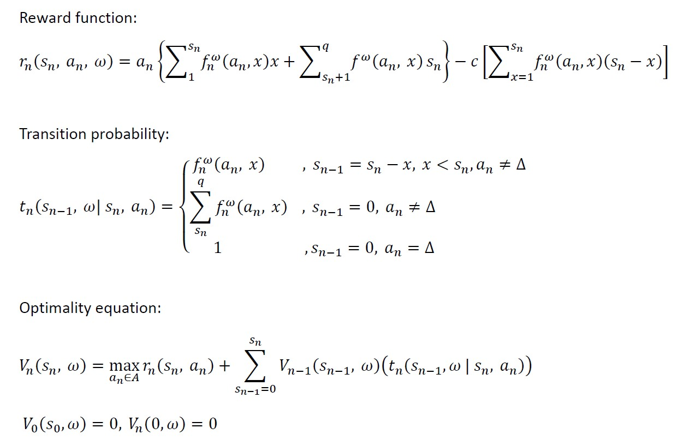

# Demand estimation and dynamic pricing in digital channels: Taking shoes selling as an example

<!-- 概要：講說不一定的點在哪 -->
<!-- 使用兩階段 stochastic dynamic Programming 規劃訂貨量和每一期的定價，並以 Arima 和 regression 作為需求估計方法。 -->

In a retailing business, pricing is an important problem, and there are various methodologies for a company to make better pricing decisions. 
Our research focuses on a sport shoes market.
Particularly, we find the ordering quantity of shoes and dynamically determine their prices in multi-periods.
The methodologies includes demand estimating and dynamic pricing.
In the demand estimating part, we apply Linear Regression and Time Series Regression, i.e., ARIMA, to analyze the historical transaction data.
In the dynamic pricing part, we implement a two-stage recourse problem with stochastic dynamic programming to optimize the ordering quantity decision and pricing strategy considering different demand scenarios.
Since the combination of two-stage recourse problem and dynamic programming is less investigated, this topic is worthy of studying.
This research may contribute to practice and provide both predictive and prescriptive analytics for our problem.

Keywords: Two-stage Recourse Problem, Dynamic Programming (Policy and Value Iteration), Linear Regression, Time Series.

NOTE: This tutorial is only for education purpose. It is not academic study/paper. All related references are listed at the end of the file.

## 編輯群 

| 編輯者       |    學號         |                      LinkedIn                                                            |
| :-----------:|:-----------:    |:---------------------------------------------------------------------------------------: |
| 陳庭姍       |   R08725044  |  http://www.linkedin.com/in/ting-shan-chen   |
| 王逸庭       |   R08725032  |   https://www.linkedin.com/in/yi-ting-wang-a2509810b/  |

## Table of Contents
- [Background and Motivation](#background-and-motivation)
- [Methodology](#methodology)
  - [Demand Estimating](#demand-estimating)
  - [Two-stage Stochastic Dynamic Programming](#two-stage-stochastic-dynamic-programming)
- [Example and Applications](#example-and-applications)
- [Comments](#comments)
- [Reference](#reference)

## Background and Motivation
<!-- Describe the motivation, background, or problem definition (you may refer to the lecture notes in ORA course). -->
Our study focus on a company, which is a e-commerce service provider in Taiwan.
The company is a sales agent for many well-know brands of daily supplies, for example, shoes, clothes, snacks, toiletries, etc.
The company may import some commodities from foreign brands to Taiwan once per year without replenishment and be responsible for selling all of them before expiring.

Suppose that it now has a demand of making an ordering and discounting plan for sport shoes on multiple online channels.
The decision making process may totally depend on the decision makers' experience, however, it becomes difficult when the decision makers are lack of experience.
Besides, even if the decision makers have lots of domain knowledge of the industry, it still takes much time to determine the prices for thousands of shoes one by one.
The purpose of this study is to construct a model to help the company make the decisions in a more reliable and efficient way based on the historical data.

For selling a commodity (in our study, shoes), the ordering quantity and prices are both important decisions, and these decisions are quite interlocking and inseparable. 
As we have learned in the ORA course, we finally come up with a two-stage recourse model in order to make these decisions simultaneously.
In the first stage, we determine the ordering quantity of the commodity, and in the second stage, we determine the discounting plan for multiple periods.
According to the uncertainty, the future demand may be high, median, or low.
As a result, we separately estimate the demand distribution under different scenarios and generate some decision suggestions for the company with the stochastic dynamic programming approach.

## Methodology
<!-- (1) write a tutorial to introduce the topic/methodology theoretically and mathematically. (2) clarify the assumptions, limitations, applicable conditions, pros, or cons of the topic/methodology you introduced. -->
Our methodology consists of two parts, which are the demand estimating and two-stage stochastic dynamic programming.
The following explains them in more details.

### Demand Estimating
Assumed that the demand distribution follows Poisson distribution.
Since the transaction amount of commodities in a retailing channel is quite small, it is more suitable to estimate the demand by using a discrete distribution.
Besides, Poisson distribution only needs one parameter, the expected value , which is more convenient for us to estimate comparing to other distribution.
These two properties explain why we do the assumption.

There are several ways to estimate the demand.
In this study, we choose Linear Regression and Autoregressive Integrated Moving Average (ARIMA) Regression to do the estimation, and thus we combine the prediction values of the two regression models to generate the final prediction result.
The target of this demand estimating step is to obtain the daily prediction amount of the demand.
Correspondingly, we may use this prediction result as the expected values, which are denoted as  given period , to build the daily demand distributions by Poisson distribution.

#### Linear Regression
Linear Regression is a very common way to build a forecasting model.
Since the main focus of this document is not on the regression method, further introduction of Linear Regression please refer to [here](https://en.wikipedia.org/wiki/Linear_regression).

Notice that one of the main purposes of our research is to find the best pricing strategy (discounting plan), it is important to find the price sensitivity of the demand, and Linear Regression provides a simpler approach to do the analysis.
This method may also include many independent variables, such as price, pageviews, and special holidays, to jointly address their impact on the demand.
Besides, the explainable coefficients that Linear Regression generates provide a way to check the rationality of our data.
For example, we can check whether the prediction is reasonable by observing the coefficient of the price.
If the estimated coefficient of the price is negative, which means that the demand declines when the price is increasing, then the prediction is acceptable. 
#### ARIMA Regression
The time series approach is also a commonly used method to construct a forecasting model.
In this study, we use Autoregressive Integrated Moving Average (ARIMA) regression model.
The most important part to build an ARIMA model is to tuning the parameters .
The parameter  represents the auto-regressive term,  represents the degree of differencing, and  represents the moving average term.
The steps of building an ARIMA model are summarized as below.

1. Statistically testing whether the time series is stationary. If not, do differencing until the time series becomes stationary.The degree of differencing is thus becoming the parameter .

2. Draw the ACF and PACF figures for the data. By observing the figures, find the possible combinations of parameters  and .

3. Build models for different parameter combinations. Choose the model with the smallest AIC as the final model.

Besides, a ARIMA regression model may also include some regressors, which allows us to take other independent variables' impact on the demand into account.
By doing so, we use this model to generate the prediction result and further build the demand distribution.
Again, since we do not put our focus on the introduction of the demand estimating method, further details about ARIMA please refer to [here](https://en.wikipedia.org/wiki/Autoregressive_integrated_moving_average).
Our implementation details can be found in the section [Example and Applications](#example-and-applications).

### Two-stage Stochastic Dynamic Programming
In the first stage, we determine the ordering quantity .
Given the wholesale price of the shoes  and scenario , our problem is to maximize the expected profit.

<!--  -->

The first term represents the total cost of purchasing the commodities.
The second term is the expected revenue of sales given the ordering quantity and demand scenario.

In the second stage, we use stochastic dynamic programming to find the optimized discounting plan and its corresponding expected revenue.
Suppose that we have total  periods.
In our stochastic dynamic model, the state is the inventory level , the action is the discount rate .
 represents the reward function, which consists of the expected revenue plus the inventory cost.
 is the transition probability. 
Notice that the function  is exactly the demand distribution we just estimated, which represents the probability of selling  pairs of shoes given the discount rate .
If the demand is smaller than the inventory level, then the transition probability of  to  is .
However, if the demand exceeds the inventory level, then the inventory level in the next period  must be 0, and the transition probability becomes the cumulative probability of  for  from current inventory level  to the maximum selling amount .
If all the shoes have been sold out, which is marked as , the current inventory level and the inventory in the next period must both be 0.
Therefore, the transition probability is 1.
Finally, the optimality equation of period  is , which equals the expected revenue of the current period plus the expected revenue from future periods.
Besides, we suppose that the salvage value equals zero.
Below shows our complete formulation of the second stage DP problem.

According to the course material, the typical ways to solve the problem are to transform it into a deterministic equivalent problem (DEP) and obtain the recourse solution, find the expected value solution, and do the scenario analysis.
Notice that we have a linear programming model in the first stage while a dynamic programming model in the second stage, we cannot directly follow the steps to transform our problem into a DEP formulation.
Since we only have one decision variable, the ordering quantity, in the first stage, we may simply run through all possible values to find the optimal solution of the recourse problem.

### Example and Applications

We take a anonymized dataset and design a scenario to show our research methods. 
The example product's origin price is NTD 3000 and cost is NTD 900, and the possible discount rates are 0.4, 0.5, 0.6, ..., 1.0..
This product just can be sold in 9 weeks with no salvage value.
The dataset contains 14 months of sales data and three channels' pageview data. 
For demand estimation, we split the dataset into the training and testing data with 2021/1/1 as a cutting boundary. 

After simple data preprocessing, we divide the products into three scenarios with K-means considering 4 characteristics, which are the total sales (售出總數), sales count (售出次數), sales
length (販售時間), and origin price (建議售價).
The three scenarios are then popular (cluster 0), common (cluster 2), and unpopular (cluster 1), and the proportion of each kind are 0.22, 0.26, and 0.52, respectively.

As aforementioned, we assume that our demand distributions all follow Poisson distribution.
We then use ARIMA and linear regression to estimate the expected value  of the demand distribution in each scenario 𝜔 and period 𝑡 considering different discount rates.
In the linear regression model, the independent variables include "price", "page views", and "whether there are holidays within seven days before and after the day". 
In the ARIMA model, we set the range of parameter  and  are in the range of 1 to 3.
In order not to ignore the impact of the price, we also include "price" and "page views" as the regressors in the ARIMA model.
By following the steps we mentioned in the previous section, we obtain the model with the smallest AIC.

We then easily combine the predictions from the two models by calculating the weighted average.
The weights are generated by the mean squared error (MSE) of the two models.
Since MSE is a the-smaller-the better criteria, we may transform the MSE by using the following formula:

 and .

After doing this process, we then aggregate the expected values.
The below image presents a brief interview about the average demand in each scenario. The result of all scenarios has a similar tendency. When the discount rate is higher, the demand is lower. Moreover, compared to the common or unpopular group, the popular group has the highest average demand given a discount rate.

The below table shows an example of the demand distribution for a specific scenario and period.
Given a discount rate and a amount of demand, we obtain the corresponding probability according to the table.
<!-- The Demand probability distribution of each scenario 𝜔 and period 𝑡. -->

After the demand estimating, we then use two-stage stochastic dynamic programming to determine the ordering quantity and pricing strategy. We use three kinds of two-stage models to solve our problem and compare their performance. 

As the result, we find the EV and recourse solution have the same ordering quantity. And in the scenario analysis, we find that if we use the ordering quantity from the recourse solution but the market condition is "popular" actually, it will lead to the least expected profit. 

We then show the detailed result by taking the EV solution as an example. Given a specific period, the pricing strategy is illustrated in the below figure.

Our result provides reasonable decision suggestions.
According to the above table and graph, we observe that when the left period is larger or when the inventory level is smaller, the discount rate can be set higher, i.e. the shoes are more expensive.

### Comments

We provide a methodology that considers the ordering quality and dynamic pricing decisions. The method combines prescriptive and predictive analysis of the dynamic pricing problem, and we solve the problem by doing demand estimation and stochastic dynamic programming. About the demand estimation methodologies, we use typical linear regression and ARIMA considering the influence of time trend.
About two-stage stochastic dynamic programming methodology, we try to plan a product's best ordering quantity and the pricing strategy.
In the first stage, we formulate profit maximization linear programming model to solve the ordering quantity.
In the second stage, we formulate a stochastic dynamic programming model to determine the discounting plan for multiple periods.
We take the stochastic demand and inventory cost into account to find an optimal pricing strategy.
We finally compare the planning results of three kinds of two-stage models, which are the recourse, EV, and scenario analysis solution, and the main differences among them is the concatenate way of the two stages.
<!-- About how to concatenate the two stages calculation, we use three models and compare the results.  -->

Our study can be extended in a couple of directions.
First, the approaches that we differentiate the demand scenarios are very simple, while the decision makers may use their domain knowledge about shoes selling market to find a better method for clustering or categorizing them.
Second, our methodology can be extended by adding the delivery time as a decision variable or considering shortage cost.
These directions call for further investigation.
<!-- backlogging into the stochastic model.  -->

### Reference
<!-- Show all your reference cited in your GitHub page. -->
* Elmaghraby, W., & Keskinocak, P. (2003). Dynamic pricing in the presence of inventory considerations: Research overview, current practices, and future directions. *Management science, 49*(10), 1287-1309.
* Den Boer, A. V. (2015). Dynamic pricing and learning: historical origins, current research, and new directions. *Surveys in operations research and management science, 20*(1), 1-18.
* Fattah, J., Ezzine, L., Aman, Z., El Moussami, H., & Lachhab, A. (2018). Forecasting of demand using ARIMA model. *International Journal of Engineering Business Management, 10*, 1-9.

