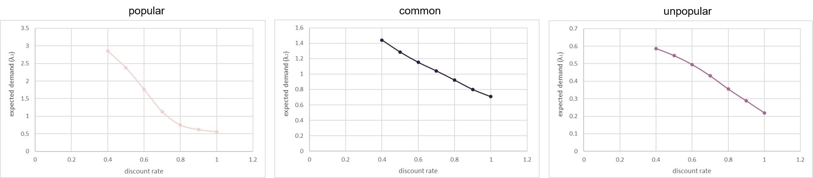

# Dynamic Pricing Problem

<!-- 概要：講說不一定的點在哪 -->
<!-- 使用兩階段 stochastic dynamic Programming 規劃訂貨量和每一期的定價，並以 Arima 和 regreession 作為需求估計方法。 -->
In a retailing business, pricing is an important problem, and there are various methodologies for a company to make better pricing decisions. 
Our research focuses on a sport shoes market.
Particularly, we find the ordering quantity of shoes and dynamically determine their prices in multi-periods.
The methodologies includes demand estimating and dynamic pricing.
In the demand estimating part, we apply Linear Regression and Time Series Regression, e.g., ARMA and ARMA, to analyze the historical transaction data.
In the dynamic pricing part, we implement a two-stage recourse problem with stochastic dynamic programming to optimize the ordering quantity decision and pricing strategy considering different demand scenarios.
Since the combination of two-stage recourse problem and dynamic programming is less investigated, this topic is worthy of studying.
This research may contribute to both practice and academia and provide both predictive and prescriptive analytics for our problem.

Keywords: Two-stage Recourse Problem, Dynamic Programming (Policy and Value Iteration), Linear Regression, Time Series.

NOTE: This tutorial is only for education purpose. It is not academic study/paper. All related references are listed at the end of the file.

## 編輯群 

| 編輯者       |    學號         |                      LinkedIn                                                            |
| :-----------:|:-----------:    |:---------------------------------------------------------------------------------------: |
| 陳庭姍       |   R08725044  |     |
| 王逸庭       |   R08725032  |     |

## Table of Contents

## Background and Motivation
<!-- Describe the motivation, background, or problem definition (you may refer to the lecture notes in ORA course). -->
Our study focus on a manufacturer, which is a e-commerce service provider in Taiwan.
The manufacturer is a sales agent for many well-know brands of daily supplies, for example, shoes, clothes, snacks, toiletries, etc.
The company may import some commodities from foreign brands to Taiwan in each period and be responsible for selling all of them before expiring.

Suppose that it now has a demand of making an ordering and discount plan for sport shoes on multiple online channels.
The decision making process may totally depend on the decision makers' experience, however, it becomes difficult when the decision makers are lack of experience.
Besides, even if the decision makers have lots of domain knowledge of the industry, it still takes much time to determine the prices for thousands of shoes one by one.
The purpose of this study is to construct a model to help the company make the decisions in a more reliable and efficient way based on the historical data.

For selling a commodity (in our study, shoes), the ordering quantity and prices are both important decisions, and these decisions are quite interlocking and inseparable. 
As we have learned in the ORA course, we finally come up with a two-stage recourse model in order to make these decisions simultaneously.
In the first stage, we determine the ordering quantity of the commodity, and in the second stage, we determine the discount plan for multiple periods.
According to the uncertainty, the future demand may be high, median, or low.
As a result, we separately estimate the demand function under different scenarios and generate some decision suggestions for the company with the stochastic dynamic approaches.

## Methodology
<!-- (1) write a tutorial to introduce the topic/methodology theoretically and mathematically. (2) clarify the assumptions, limitations, applicable conditions, pros, or cons of the topic/methodology you introduced. -->
Our methodology consists of two parts, which are demand estimating and two-stage stochastic dynamic programming.
The following explains them in more details.

### Demand Estimating
Assumed that the demand distribution follows Poisson distribution.
Since the transaction amount of commodities in a retailing channel is quite small, it is more suitable to estimate the demand by using a discrete distribution.
Besides, Poisson distribution only needs one parameter, the expected value $\lambda$, which is more convenient for us to estimate comparing to other distribution.
These two properties explain why we do the assumption.

There are several ways to estimate the demand.
In this study, we choose the Linear Regression and Autoregressive Integrated Moving Average (ARIMA) Regression to do the estimation, and thus we combine the prediction values of the two regression models to generate the final prediction result.
The target of this demand estimating step is to obtain the daily prediction amount of the demand.
Correspondingly, we may use this prediction result as the expected value, which is denoted as $\lambda_t$, to build the daily demand distribution by Poisson distribution.

#### Linear Regression
Linear Regression is a very common way to build a forecasting model.
Since the main focus of this document is not the on the regression method, further introduction of Linear Regression please refer to [here](https://en.wikipedia.org/wiki/Linear_regression).

Notice that one of the main purposes of our research is to find the best pricing strategy (discount plan), it is important to find the price sensitivity of the demand, and Linear Regression provides a simpler approach to do the analysis.
This method may also include many independent variables, such as viewing count and special holidays, to jointly address their impact on the demand.
Besides, the explainable coefficients that Linear Regression generates provide a way to check the rationality of our data.
For example, we can check whether the prediction is reasonable by observing the coefficient of the price.
If the estimated coefficient of the price is negative, which means that the demand declines when the price is increasing, then the prediction is acceptable. 
#### ARIMA Regression
The time series approach is also a commonly used method to construct a forecasting model.
In this study, we use Autoregressive integrated moving average model.
The most important part to build an ARIMA model is to tuning the parameters $(p, d, q)$.
The parameter $p$ represents the auto-regressive term, $d$ represents the degree of differencing, and $q$ represents the moving average term.
The steps of building an ARIMA model are summarized as below.

1. Statistically testing whether the time series is stationary. If not, do differencing until the time series becomes stationary.The degree of differencing is thus becoming the parameter $d$.

2. Draw the ACF and PACF figures for the data. By observing the figures, find the possible combinations of parameters $p$ and $q$.

3. Build models for different parameter combinations. Choose the model with the smallest AIC as the final model.

Besides, a ARIMA regression model may also include some regressors, which allows us to take other independent variables' impact on the demand into account.
By doing so, we use this model to generate the prediction result and further build the demand distribution.
Again, since we do not put our focus on the introduction of the demand estimating method, further details about ARIMA please refer to [here](https://en.wikipedia.org/wiki/Autoregressive_integrated_moving_average).
Our implemenation details can be found in the section [Example and Applications](#example-and-applications).

### Two-stage Stochastic Dynamic Programming
In the first stage, we determine the ordering quantity.
In next stage, we use Stochastic Dynamic Programming to find the optimized discount plan and its corresponding expected revenue.
<!-- t3 -->

### Example and Applications
<!-- give a small and understandable example for python illustration. The example could include dataset, define variables, introduce solver, set up experiments, clarify the numerical analysis result, or provide some managerial implications. -->
we take anonymized datasets and design a scenario to show our research methods. 
The example product's origin price is NT 3000 and cost is NT 900. This product just can be sold in 9 weeks with no salvage value. 
The datasets contain 14 months of sales data and three channels' pageview data. 
For demand estimation, we split datasets into train and test data with the 2021/1/1 as the boundary. 

After simple data preprocessing, we divide the products into three scenarios with K-means considering 4 characteristics: popular (cluster 0), common (cluster 2), and unpopular (cluster 1). The ratio of each kind: 0.22, 0.26, and 0.52, respectively.

Then we use ARIMA and linear regression to estimate the demand distribution in each scenario and period  considering different discount rate.
Demand probability distribution of each sceario 𝜔 and period 𝑡.

The below image presents a brief interview about average demand in each scenario. The result of all scenarios have a similar tendency. When the discount rate is higher, the demand is lower. Moreover, compared to a common or unpopular one, popular has highest average demand in each discount rate.

After demand forecasting, we then use two-stage stochastic dynamic programming to determine order quantity and price strategy. We use three two-stage methods. 

As the result, we find EV and recourse have the same order quantity. And, in Scenario Analysis, we find if we guess wrongly as popular, the expected profit will be most less one. Then, we will show the detailed result of each model. For one price strategy, the result is shown on the below picture.

### Comments
<!-- What’s your comment or insights to the topic/methodologies you introduced? -->
<!-- 1t -->
We provide a methodology combines ordering quality and dynamic pricing decisions. The method combined presciptive and predictive demand estimation and stochastic dynamic programming. About demand estimation, we use typical linear regression and ARIMA considering time influence. About two-stage stochatic dynamic programming, we try to plan a product's best order quantity and next price strategy. In the first stage, it is an linear problem. In second stage, we take salvage value ,demand fluctuation, and inventory cost into account to find optimal pricing strategy. About how to concatenate the two stages caculation, we use three models and compared the results. 

The approaches that we differciate demand scenarios is very simple. About the future work, the decision maker can use the shoe domain knowledge to find greater Differentiation method about demand scenario. About the methodology, we may take time of delievery into account or backlogging into stochastic model. 

### Reference
<!-- Show all your reference cited in your GitHub page. -->
* Elmaghraby, W., & Keskinocak, P. (2003). Dynamic pricing in the presence of inventory considerations: Research overview, current practices, and future directions. Management science, 49(10), 1287-1309.
* Den Boer, A. V. (2015). Dynamic pricing and learning: historical origins, current research, and new directions. Surveys in operations research and management science, 20(1), 1-18.
* Fattah, J., Ezzine, L., Aman, Z., El Moussami, H., & Lachhab, A. (2018). Forecasting of demand using ARIMA model. International Journal of Engineering Business Management, 10

